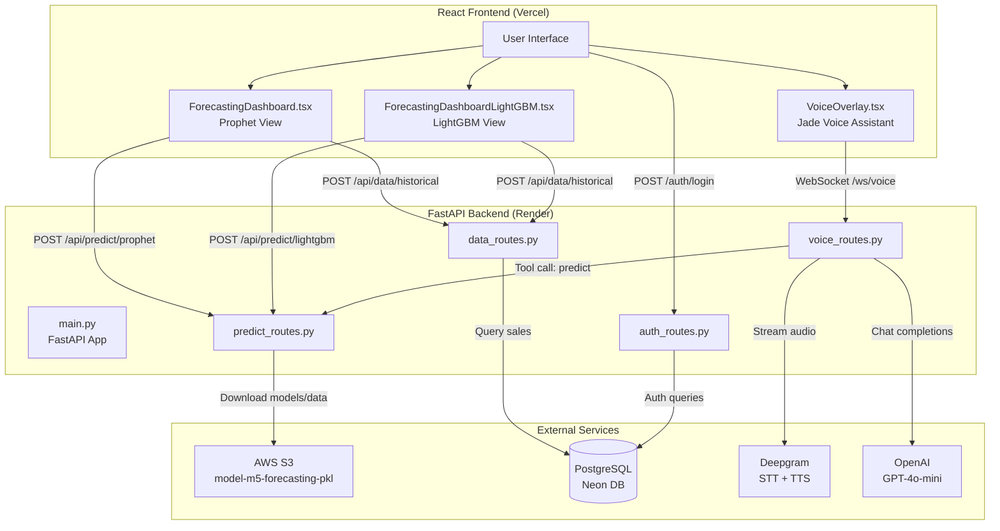
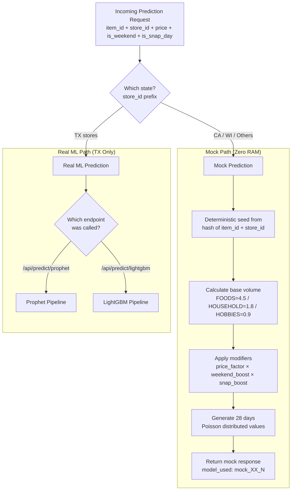
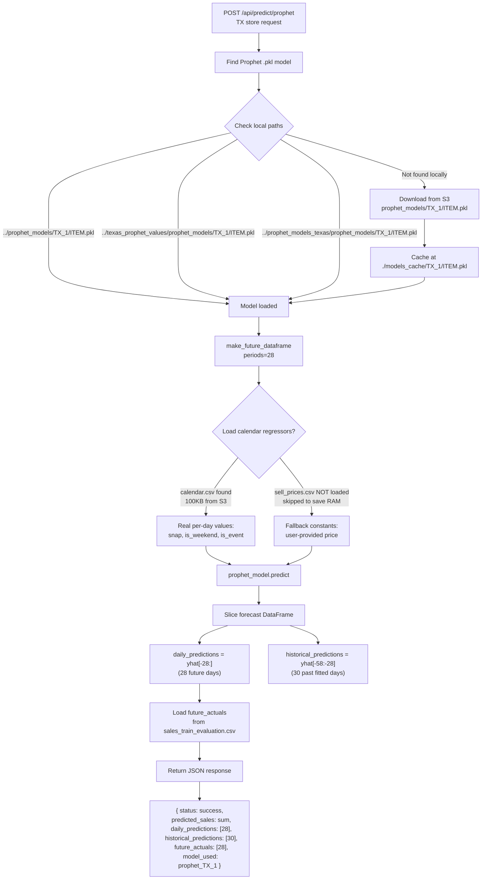
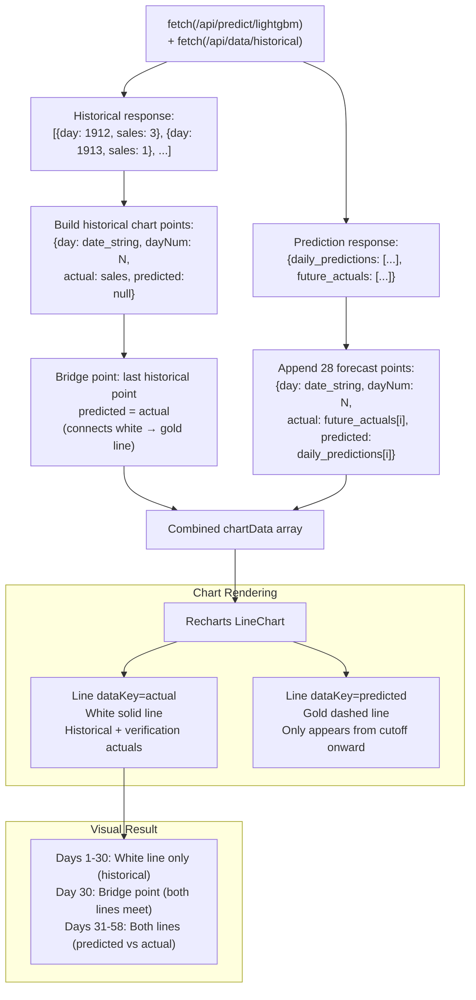
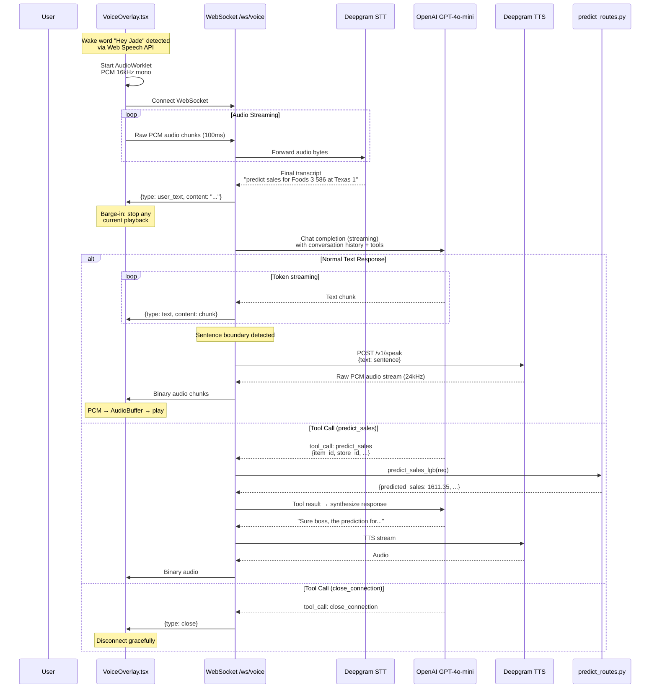
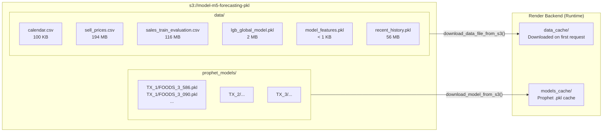
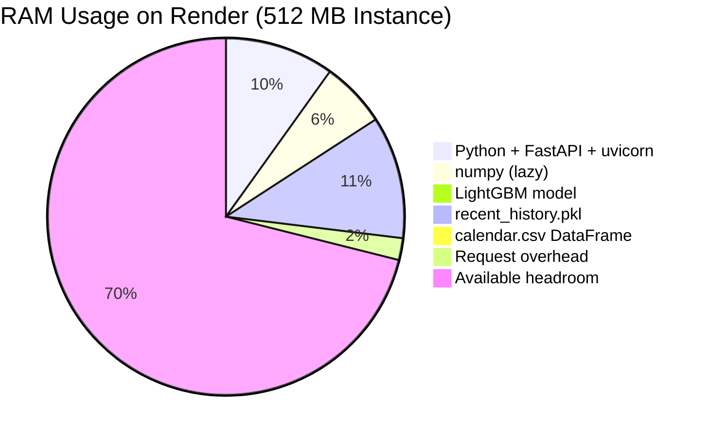
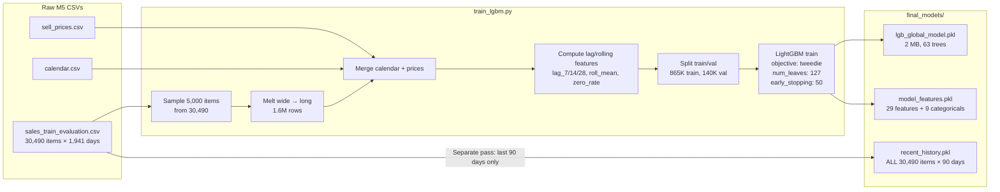
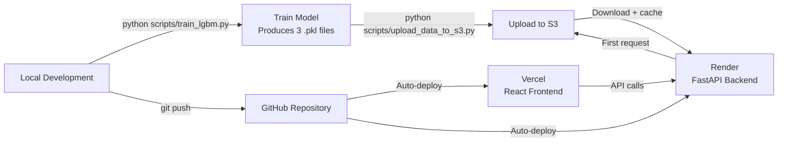

# M5 Forecasting Engine — Full Architecture Flow

## System Overview



---

## Prediction Flow — Region Gating



---

## Prophet Prediction Pipeline (TX Only)



---

## LightGBM Prediction Pipeline (TX Only)

```mermaid
flowchart TD
    START[POST /api/predict/lightgbm<br/>TX store request]

    START --> MODEL[Load global LightGBM model]

    subgraph Model Loading ["One-time Model Loading (cached in memory)"]
        MODEL --> MLOCAL{Check local paths}
        MLOCAL -->|"../final_models/lgb_global_model.pkl"| MFOUND
        MLOCAL -->|Not found| MS3[Download from S3<br/>data/lgb_global_model.pkl]
        MS3 --> MCACHE[Cache at ./data_cache/lgb_global_model.pkl]
        MCACHE --> MFOUND[Model in memory<br/>2 MB]
    end

    MFOUND --> FEATURES[Load model_features.pkl<br/>feature list + cat features]
    FEATURES --> HISTORY[Load recent_history.pkl<br/>90 days × 30K items = 56 MB]

    HISTORY --> BUILD[Build 28-row feature DataFrame]

    subgraph Feature Engineering ["_build_lgb_features()"]
        BUILD --> LOOKUP[Find item's sales history<br/>from recent_history.pkl]
        LOOKUP --> LAGS[Compute lag features<br/>lag_7, lag_14, lag_28]
        LAGS --> ROLLING[Compute rolling stats<br/>roll_mean_7/28/90<br/>roll_zero_rate_7/28/90]
        ROLLING --> CALENDAR[Add calendar features<br/>wday, month, year, is_weekend]
        CALENDAR --> META[Add item metadata<br/>item_id, dept_id, cat_id, store_id, state_id]
        META --> PRICE[Add price features<br/>sell_price, price_roll_mean_28]
        PRICE --> ENCODE[Encode categoricals<br/>astype category]
        ENCODE --> ORDER[Ensure column order<br/>matches training]
    end

    ORDER --> PREDICT["model.predict(feature_df)<br/>Returns 28 daily values"]

    PREDICT --> CLIP[Clip negatives to 0]
    CLIP --> HISTSALES[Get historical_actuals<br/>from recent_history last 30 days]
    HISTSALES --> ACTUALS[Get future_actuals<br/>from sales_train_evaluation.csv]
    ACTUALS --> RESP[Return JSON response]

    RESP --> RESPONSE["{ status: success,<br/>  predicted_sales: sum,<br/>  daily_predictions: [28],<br/>  historical_actuals: [30],<br/>  future_actuals: [28],<br/>  model_used: lightgbm_TX_1 }"]
```



---

## Frontend Chart Construction



---

## Jade Voice Pipeline



---

## S3 Storage Layout



---

## Memory Budget (Render Production)



---

## Training Pipeline



---

## Deployment Flow



---

## File Structure

```
cognizant/notebooks/
├── backend/
│   ├── main.py                          # FastAPI app entry point
│   ├── requirements.txt                 # Python dependencies
│   ├── render.yaml                      # Render deployment config
│   ├── routes/
│   │   ├── predict_routes.py            # /api/predict/prophet + /api/predict/lightgbm
│   │   ├── voice_routes.py              # /ws/voice WebSocket (Jade)
│   │   ├── data_routes.py              # /api/data/historical + insights
│   │   └── auth_routes.py              # /auth/login
│   ├── utils/
│   │   ├── s3_utils.py                  # S3 download helpers
│   │   ├── calendar_utils.py            # Calendar/price data loading
│   │   └── auth_utils.py               # JWT + password hashing
│   ├── db/
│   │   └── db.py                        # PostgreSQL connection + schema
│   └── scripts/
│       ├── train_lgbm.py                # LightGBM training script
│       ├── upload_data_to_s3.py         # Upload models + CSVs to S3
│       └── seed_admin.py                # Seed admin user
├── react_frontend/
│   ├── src/
│   │   ├── pages/
│   │   │   ├── ForecastingDashboard.tsx         # Prophet chart view
│   │   │   └── ForecastingDashboardLightGBM.tsx # LightGBM chart view
│   │   ├── components/
│   │   │   └── VoiceOverlay.tsx                 # Jade voice UI
│   │   └── config.ts                            # API_BASE_URL / WS_BASE_URL
│   └── public/
│       └── pcm-processor.js                     # AudioWorklet for mic capture
├── final_models/
│   ├── lgb_global_model.pkl             # Trained LightGBM (2 MB)
│   ├── model_features.pkl              # Feature schema
│   └── recent_history.pkl              # 90-day sales history (56 MB)
├── m5-forecasting-accuracy/             # Raw M5 competition data (gitignored)
│   ├── calendar.csv
│   ├── sell_prices.csv
│   └── sales_train_evaluation.csv
└── texas_prophet_values/                # Prophet models for TX (gitignored)
    └── prophet_models/
        ├── TX_1/
        ├── TX_2/
        └── TX_3/
```
